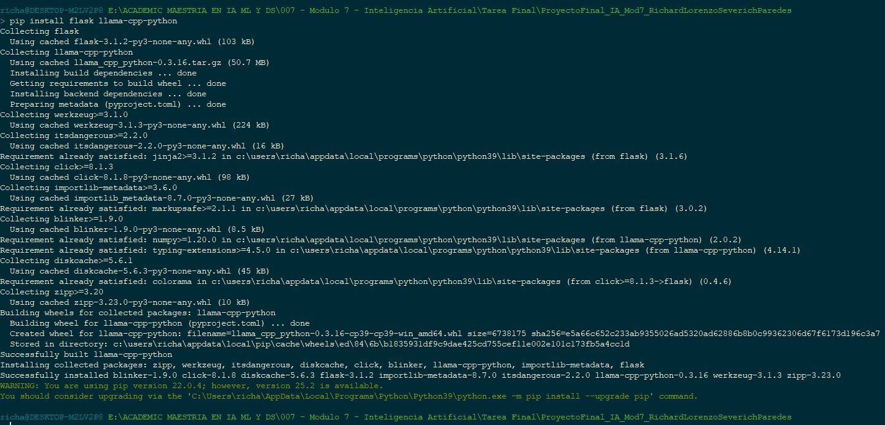
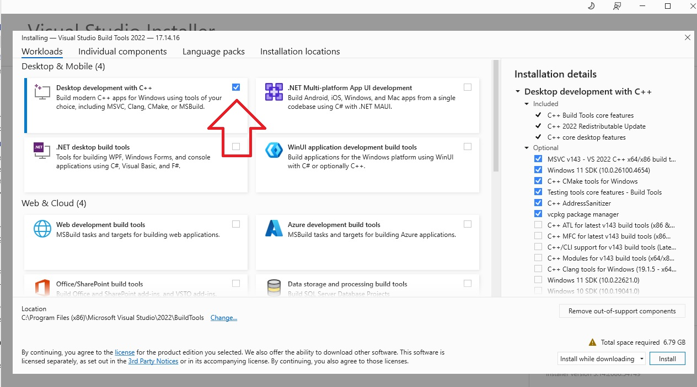
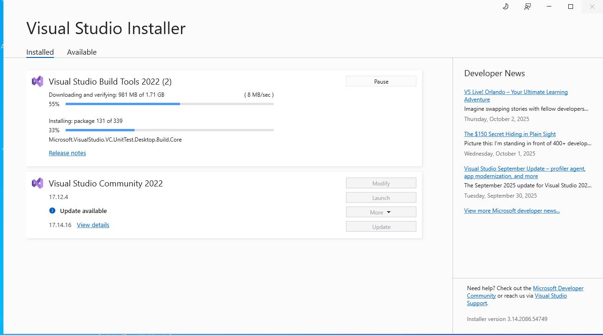
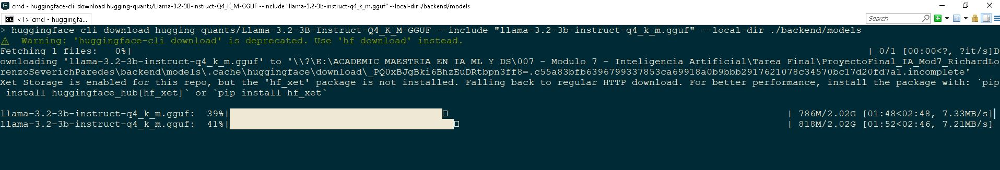
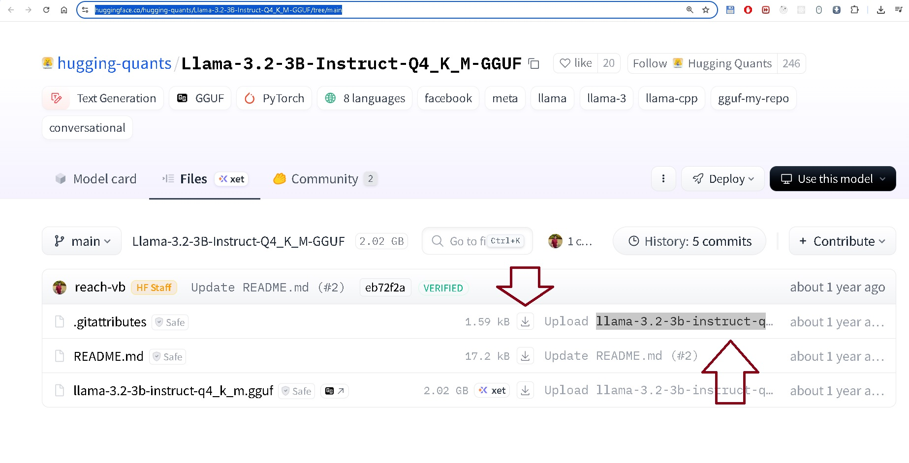

# 🤖 Chatbot Local - Juguetería Mundo Mágico

Este proyecto es un chatbot que funciona **totalmente offline** usando el modelo **LLaMA 3 3B Instruct** con `llama-cpp-python` y una interfaz web en **Flask + HTML**.

Ideal para probar asistentes conversacionales sin conexión a Internet ni necesidad de usar APIs externas (como OpenAI).

---

## 📁 Estructura del Proyecto

```
proyecto/
├── app.py                  # Servidor Flask
├── models/
│   └── llama-3-3b.gguf     # Modelo LLaMA 3 3B Instruct (formato GGUF)
├── templates/
│   └── index.html          # Interfaz web simple
├── README.md
```

---

## ✅ Requisitos

- Python 3.8 o superior
- CPU moderna (opcional: GPU con soporte para acelerar)
- RAM: al menos 6–8 GB libres (modelo 3B)

---

## 🧰 Instalación de dependencias

1. Crea un entorno virtual (opcional pero recomendado):

```bash
python -m venv venv
source venv/bin/activate  # En Windows: venv\\Scripts\\activate
```

2. Instala las dependencias:

```bash
pip install flask
```

```bash
pip install flask-cors
```

```bash
pip install llama-cpp-python
```



> Si estás en Windows y al instalar llama-cpp da error, necesitas descargar cpp-build-tools, reinicia y prueba instalar de nuevo:
Durante la instalación marca Desktop development with C++.
Esto instalará cl.exe y nmake, que son lo que CMake necesita
```
https://visualstudio.microsoft.com/es/visual-cpp-build-tools/
```
.




---

## 📦 Descargar el modelo LLaMA 3 3B

1.  Ejecuta: `pip install huggingface_hub`

2. Ejecuta en la raiz del proyecto: `huggingface-cli download hugging-quants/Llama-3.2-3B-Instruct-Q4_K_M-GGUF --include "llama-3.2-3b-instruct-q4_k_m.gguf" --local-dir ./models`



3. El paso anterior descargar el modelo en `models/`

4. otra opcion es descargar manualmente de: `https://huggingface.co/hugging-quants/Llama-3.2-3B-Instruct-Q4_K_M-GGUF/tree/main`




```
proyecto/
└── models/
    └── llama-3-3b-instruct.Q4_K_M.gguf
```

---

## 🚀 Cómo ejecutar el chatbot

1. Asegúrate de tener el modelo `.gguf` en `models/`
2. Ejecuta el servidor Flask:

```bash
python app.py
```

3. Abre tu navegador en:

```
http://127.0.0.1:5000/
```

4. Empieza a chatear con el asistente virtual de la tienda de juguetes.

---

## 🛠️ Personalización

Puedes editar el archivo `app.py` para:

- Cambiar el prompt del chatbot
- Agregar funciones personalizadas (como guardar pedidos)
- Mejorar el historial del chat

Y editar `templates/index.html` para:

- Personalizar el estilo visual
- Cambiar colores, fuente, tamaño, etc.

---

## ✅ Tecnologías usadas

- [LLaMA 3 3B Instruct](https://huggingface.co/meta-llama)
- [`llama-cpp-python`](https://github.com/abetlen/llama-cpp-python)
- [Flask](https://flask.palletsprojects.com/)
- HTML/CSS básico

---

## 📃 Licencia

Este proyecto es de uso libre con fines educativos y personales.

---

## 📬 Contacto

¿Preguntas o sugerencias? ¡Contáctame por GitHub o crea un issue!
